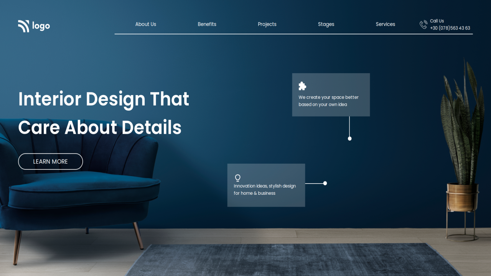

# Project 10

### `Nishok Maharaaj`

## Learnings    

In the tenth project of HTML and CSS class I got more knowledge on `positioning`, `margins` and `flex-box`. Done some custom shapes(lines and circles) and positioned accordingly. Made the website fully responsive using CSS `@media-queries`.

[Project Live Link](https://nishok-html-css-proj10.netlify.app/)

## Efforts

This project took around 5 hours to build with some learnings on position and flex-box.

### Screenshot

